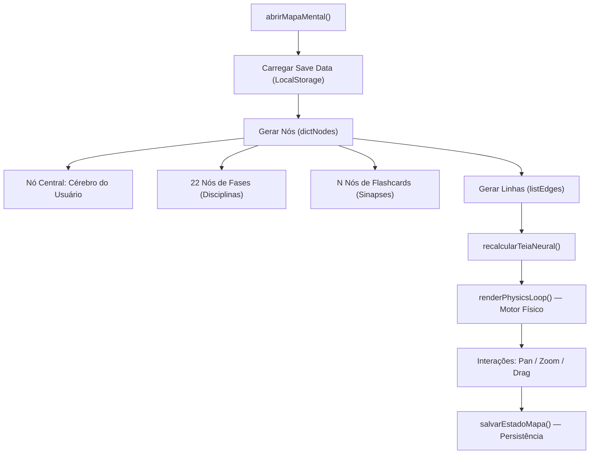

# 🧠 Análise do Mapa Neural — Pasta OLD

## Visão Geral

O **Mapa Neural** (internamente chamado de "Obsidian View") é um **motor gráfico 2D completo** com física de molas, pan/zoom, drag-and-drop e persistência de estado. Ele visualiza o progresso do aluno como uma **teia neural interativa** — cada disciplina é um nó, cada flashcard estudado vira uma sinapse flutuante.

---

## 🏗️ Arquitetura do Sistema



---

## 📦 Inventário de Código

### JavaScript — [app.js](file:///c:/Users/mayco/Documents/GitHub/PIM_III/PIM_III-Parte_Pratica/OLD/app.js) (Linhas 752–1162)

| Seção | Linhas | Responsabilidade |
|-------|--------|-----------------|
| **Variáveis Globais** | 754–757 | `graphScale`, `graphPanX`, `graphPanY`, `animationFrameId` |
| **abrirMapaMental()** | 759–1162 | Função principal — orquestra tudo |
| **Carregar Save** | 769–781 | Restaura posição da câmera e dos nós do `localStorage` |
| **Nó Central** | 792–806 | Cria o "Cérebro" do aluno (nó roxo central, size 45) |
| **Nós de Fases** | 810–892 | Loop por `ordemFases[0..21]`, gera posição orbital ou carrega do save |
| **Nós de Flashcards** | 854–891 | Até 30 sinapses visuais por fase desbloqueada |
| **Edges (Linhas)** | 896–902 | `div.obsidian-edge` com opacidade variável |
| **recalcularTeiaNeural()** | 904–920 | Recalcula posição/ângulo de cada edge DOM |
| **salvarEstadoMapa()** | 929–943 | Serializa `dictNodes` + câmera no `localStorage` |
| **criarNoVisual()** | 950–1012 | Factory: cria DOM + pulso + click flashcard + drag |
| **renderPhysicsLoop()** | 1017–1045 | Motor de molas elásticas (Spring Physics) com `requestAnimationFrame` |
| **Pan & Zoom** | 1059–1157 | Mouse wheel, arraste da câmera, botões zoom in/out |
| **atualizarCamera()** | 1159–1161 | `transform: translate() scale()` no canvas |

### CSS — [global.css](file:///c:/Users/mayco/Documents/GitHub/PIM_III/PIM_III-Parte_Pratica/OLD/global.css) (Linhas 147–216)

| Classe | Propósito |
|--------|-----------|
| `.obsidian-canvas` | Container 4000×4000px, fundo pontilhado radial, `transform-origin: 0 0` |
| `.obsidian-node` | Nó circular, `position: absolute`, `cursor: grab`, `z-index: 10` |
| `.obsidian-node .label` | Label tooltip (oculto, aparece no hover) |
| `.obsidian-edge` | Linha de conexão, `height: 1px`, `transform-origin: 0 50%` |
| `.neural-pulse` | Efeito de onda ao clicar num nó (animação `pulseOut`) |
| `.mini-flashcard` | Pop-up flutuante com pergunta/resposta do flashcard |

### HTML — [home.html](file:///c:/Users/mayco/Documents/GitHub/PIM_III/PIM_III-Parte_Pratica/OLD/home.html) (Linhas 268–303)

| Elemento | Função |
|----------|--------|
| `#modalMapaMental` | Modal fullscreen (90vw × 90vh) com borda roxa |
| `#mapa-mental-body` | Contêiner com `overflow: hidden`, `cursor: grab` |
| `#obsidian-canvas` | Canvas onde os nós e edges são injetados via JS |
| `#a11y-widget-map` | Widget flutuante com botões Zoom In/Out/Contraste |

---

## ⚙️ Motor Físico — Spring Physics

O sistema usa um **algoritmo de molas elásticas** para manter a organicidade visual:

```javascript
// Cada nó filho segue o pai com um offset (órbita)
const targetX = parent.x + node.offsetX;
const targetY = parent.y + node.offsetY;

const dx = targetX - node.x;
const dy = targetY - node.y;

// Suavização com fator 0.15 (quanto menor, mais elástico)
node.x += dx * 0.15;
node.y += dy * 0.15;
```

**Hierarquia de parentesco:**
- `Central (Cérebro)` → **sem pai** (posição fixa/arrastável)
- `Fase N` → **pai: Central** (orbita ao redor do cérebro)
- `Flashcard` → **pai: Fase N** (orbita ao redor da fase)

Ao arrastar um nó pai, todos os filhos **seguem elasticamente** graças ao `renderPhysicsLoop()` que roda a 60fps via `requestAnimationFrame`.

---

## 💾 Sistema de Persistência

```javascript
// Chave: quest_{nomeUsuario}_map_state
const mapSaveKey = userKey + 'map_state';

// Estrutura salva:
{
    camera: { scale: 1.0, panX: 200, panY: 150 },
    nodes: {
        "central":   { x: 2000, y: 2000, offsetX: 0, offsetY: 0 },
        "fase1":     { x: 2350, y: 1800, offsetX: 350, offsetY: -200 },
        "fase1_card_0": { x: 2450, y: 1750, offsetX: 100, offsetY: -50 },
        // ...
    }
}
```

> [!IMPORTANT]
> O mapa salva automaticamente em 3 momentos:
> 1. Ao **soltar um nó** arrastado (`mouseup` no drag)
> 2. Ao **parar de mover a câmera** (`mouseup` no pan)
> 3. Ao **aplicar zoom** (wheel ou botões)

---

## 🎨 Interações do Usuário

| Ação | Mecanismo | Efeito |
|------|-----------|--------|
| **Scroll do mouse** | `wheel` event com `deltaY * -0.0015` | Zoom in/out (0.2x → 3.0x) |
| **Arrastar fundo** | `mousedown` + `mousemove` | Pan da câmera |
| **Arrastar nó** | `mousedown` no `.obsidian-node` | Move nó + recalcula órbita |
| **Click em flashcard** | `click` no nó pequeno | Exibe `.mini-flashcard` com P/R |
| **Click no fundo** | `mousedown` fora de nó | Remove flashcards abertos |
| **Pulso neural** | `mousedown` em qualquer nó | Animação de onda expandindo |

---

## 🔗 Dependências do Mapa

Para o mapa funcionar, ele **depende** destes sistemas já existentes no `app.js`:

1. **`meusDecks`** — banco de flashcards por fase
2. **`srsData`** — dados do algoritmo ANKI (saber quais cartas foram estudadas)
3. **`fasesDesbloqueadas`** — array de fases que o usuário desbloqueou
4. **`ordemFases`** — `['fase1', 'fase2', ..., 'fase22']`
5. **`nomeSalvo`** / **`userKey`** — identidade do usuário para o localStorage
6. **`abrirModal()` / `fecharModal()`** — sistema de modais

---

## 🧩 O que será necessário para migrar

Para integrar o Mapa Neural na arquitetura atual do projeto (modular, com Separation of Concerns):

| Tarefa | Detalhes |
|--------|----------|
| **Extrair HTML** | O modal `#modalMapaMental` + widget de controles |
| **Extrair CSS** | Classes `.obsidian-*`, `.neural-pulse`, `.mini-flashcard` + animações `pulseOut` |
| **Extrair JS** | Seção 8 inteira (linhas 752–1162) como módulo separado (ex: `neural-map.js`) |
| **Adaptar dados** | Conectar com a fonte de dados atual (JSON ou API) em vez do `bancoDeDados` global |
| **Resolver dependências** | Garantir acesso a `meusDecks`, `srsData`, `fasesDesbloqueadas`, etc. |
